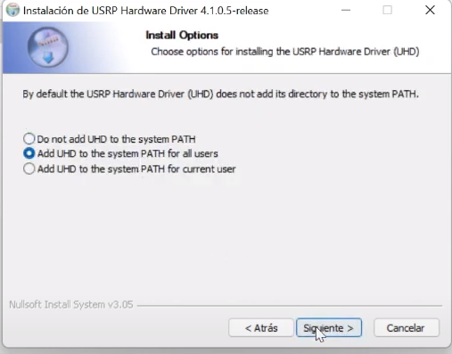

# GNU-RADIO_USRP

## Descripción:  

Este repositorio contiene una guía de inicialización y los controladores de la tarjeta USRP B200/B210 para trabajar en GNU Radio, para encontrar toda la documentación referente a USRP, puede consultarla el [Manual USRP](https://files.ettus.com/manual/) aca podrá encontrar las instrucciones y enlaces de interés para la [instalación](https://files.ettus.com/manual/page_install.html) ademas encontrara su [información técnica](https://www.ettus.com/wp-content/uploads/2019/01/b200-b210_spec_sheet.pdf).

## Estructura del repositorio

[1. Ejemplos:](/Ejemplos/) Carpeta que contiene información básica de como usar GNU-Radio con USRP para transmisión y recepción, también encontrara algunos ejemplos para su uso.

[2. IMG: ](/IMG) Carpeta con imágenes adjuntos en repositorio. 

[3. Test:](/Test) Carpeta con archivo de GNU-Radio para verificar el rendimiento de USRP , también contiene un ejemplo de transmisión y recepción .

## Instalación: 

Para instalar GNU Radio en cualquier plataforma, puede seguir las instrucciones suministradas por la [documentación oficial](https://wiki.gnuradio.org/index.php/InstallingGR).

## Instalación en Windows

El primer programa que necesita es el controlador de hardware USRP (UHD) e imágenes de la FPGA. Puede encontrar muchas versiones diferentes de los UHD-binarios con el siguiente enlace [files.ettus](https://files.ettus.com/binaries/uhd/latest_release/4.3.0.0/), diríjase a la carpeta `Windows-10-x64` y descargue el ejecutable


Abra el instalador, asegúrese de seleccionar `Add UHD to the system PATH` y continue con la Instalación.



Luego debe descargar e instalar los controladores [USB UHD](https://files.ettus.com/binaries/misc/) deberá descargar el [erllc_uhd_winusb_driver.zip](https://files.ettus.com/binaries/misc/erllc_uhd_winusb_driver.zip). Deberá añadir el controlador en administrador de dispositivos, selecciona agregar controladores o se dirige a USRP, actualizar controlador. 


Una vez instalado, en el símbolo de sistema use `uhd_find_devices` debe salirle:

```cmd
uhd_find_devices
```


Si al ejecutar `uhd_find_devices`, aparece un mensaje de error que indica que libusb-1.0.dll no se puede encontrar en su sistema, puede descargarlo aquí: [libusb-1.0.dll ](https://www.dll-files.com/libusb-1.0.dll.html)


Después de descargar libusb-1.0.dll, debe copiar el archivo dll en la carpeta `UHD\bin`. La ruta a la carpeta UHD debe ser `C:\Program Files\UHD\bin`, si sigue presentando el error cargue este mismo archivo a la ruta System32 esta debe ser `C:\Windows\System32`.

También debe copiar uhd.dll en la carpeta System32. Puede encontrar uhd.dll en `C:\Program Files\UHD\bin`, 


## Prueba de conexión USRP

Puede verificar la conexión de la USRP con Windows-Terminal presionando la "tecla de Windows" y la "R" al mismo tiempo. Se abrirá la ventana de ejecución. Escriba "cmd" y presiona Enter use nuevamente `uhd_find_devices` para verificar que el PC puede encontrar la USRP.

```cmd
uhd_find_devices
```

También puede verificar algunas propiedades mas de la USRP con `uhd_usrp_probe`, esto muestra la versión de firmware y la versión de FPGA que usa USRP. También muestra la interfaz RX y TX y la placa secundaria.

```cmd
uhd_usrp_probe
```


En este caso, usamos el USRP B200 con la versión de firmware 8.0 y la versión 16.0 de FPGA. Puede ver el rango de frecuencia de la interfaz RX y TX de 50 MHz a 6 GHz. También muestra el rango de ganancia de 0 a 76,0, el ancho de banda de 200 KHz a 56 MHz.

Aca podrá encontrar los diferentes comandos que puede utilizar [Comandos generales UHD](https://www.mankier.com/package/uhd).


### Prueba de conexión USRP

Puede verificar la conexión de la USRP con Windows-Terminal presionando la "tecla de Windows" y la "R" al mismo tiempo. Se abrirá la ventana de ejecución. Escriba "cmd" y presiona Enter use nuevamente `uhd_find_devices` para verificar que el PC puede encontrar la USRP.

```cmd
uhd_find_devices
```

También puede verificar algunas propiedades mas de la USRP con `uhd_usrp_probe`, esto muestra la versión de firmware y la versión de FPGA que usa USRP. También muestra la interfaz RX y TX y la placa secundaria.

```cmd
uhd_usrp_probe
```


En este caso, usamos el USRP B200 con la versión de firmware 8.0 y la versión 16.0 de FPGA. Puede ver el rango de frecuencia de la interfaz RX y TX de 50 MHz a 6 GHz. También muestra el rango de ganancia de 0 a 76,0, el ancho de banda de 200 KHz a 56 MHz.

Aca podrá encontrar los diferentes comandos que puede utilizar [Comandos generales UHD](https://www.mankier.com/package/uhd).

## Instalación en Raspberry PI:

En muchos casos, los controladores necesarios para el USRP B200/B210 ya están incluidos en el kernel del sistema operativo de Raspberry PI, por lo que deberían reconocerse automáticamente cuando conecte el dispositivo a la Raspberry Pi. Para verificar si el USRP B200/B210 es reconocido, puedes ejecutar el siguiente comando en la terminal:
 
```bat
lsusb
```


Esto mostrara una lista con los dispositivos USB conectados a la Raspberry Pi, y el USRP B200 debería aparecer en la lista.

Si el dispositivo no es reconocido automáticamente, es posible que necesites instalar los controladores UHD (USRP Hardware Driver). Para ello, sigue los siguientes pasos o consultar la documentación oficial de [ettus](https://kb.ettus.com/Building_and_Installing_the_USRP_Open-Source_Toolchain_(UHD_and_GNU_Radio)_on_Linux):
 
Primero debe actualiza el sistema e instala las herramientas de compilación, instalación de paquetes recomendados:

```bat
sudo apt-get update
```
```bat
sudo apt install python3-matplotlib python3-networkx python3-pyqt5.qwt libeigen3-dev python3-json-pointer python3-rfc3987 python3-uritemplate python3-webcolors python3-pyqt5.qtopengl
```

Crear un directorio en el directorio HOME de Pi donde va a guardar el repositorio UHD clonado desde GitHub.

```bat
mkdir workarea -uhd
```
```bat
cd workarea -uhd
```

Clona el repositorio UHD desde GitHub y accede al directorio.

```bat
git clone https://github.com/EttusResearch/uhd.git
```
```bat
cd uhd
```
Crea otro directorio en host y creación de archivos Cmake.

```bat
cd host
```
```bat
mkdir build
```
```bat
cd build
```
```bat
cmake ../
```
```bat
make
```

Realiza algunas pruebas básicas para verificar que el proceso de compilación se completó correctamente.

```bat
make test
```

Instala UHD.

```bat
sudo make install
```

Actualizar la memoria caché de la biblioteca compartida del sistema.

```bat
sudo ldconfig
```

Cargando e instalación de las imágenes UHD FPGA, esta tarea debería realizado yendo al directorio HOME de Pi

```bat
sudo uhd_image_downloader
```

Configuración de ruta para imágenes.

```bat
export LD_LIBRARY PATH=$LD_LIBRARY_PATH:/usr/local/lib
```

### Verificación del dispositivo USRP 

Puede verificar la conexión e instalación de los controladores de la USRP en el terminal 

```bat
sudo uhd_find_devices
```


Al igual que en windows puede verificar algunas propiedades mas de la USRP con uhd_usrp_probe, esto muestra la versión de firmware y la versión de FPGA que usa USRP.


Adicionalmente en el terminal de Raspberry PI usando el script build-gnu-radio puede utilizar `uhd_fft` este es una herramienta de análisis de espectro muy simple que utiliza un dispositivo UHD conectado para mostrar el espectro en una frecuencia determinada. 

```bat
uhd_fft -f 2.4G
```


Puede encontrar mas herramientas y programas incluidas con GNU-Radio en el siguiente [link](https://wiki.gnuradio.org/index.php/HowToUse)

## Instalación GNU-Radio 


### Instalación GNU-Radio Windows 

En este repositorio de GitHub podrá encontrar los instaladores de Gnu-Radio para diferentes plataformas como soporte para dispositivos SDR [Repositorio](https://github.com/ryanvolz/radioconda#uhd-ettus-usrp).

Si desea `descargar una version diferente` de GNU-Radio podrá encontrarla en el siguiente [Repositorio](https://github.com/ryanvolz/radioconda/releases?page=1).

### Instalación GNU-Radio Raspberry PI

GNU-Radio por lo general ya están incluidos en el kernel del sistema operativo de Raspberry PI, de no ser asi puede añadirlo desde, preferencias, add/remove software, busca `gnuradio`. 


También puede instalarlo desde la terminal de raspberry 

```bat
sudo apt-get install -y gnuradio
```
```bat
sudo apt-get install -y gnuradio-dev
```

